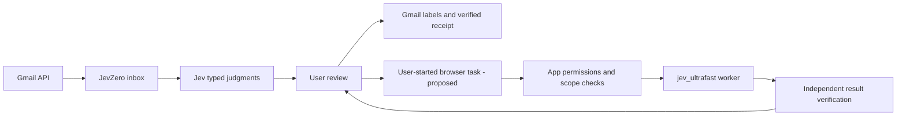

# JevZero and jev_ultrafast

Status: the classifier and local Python/Next.js application are implemented. The optional browser worker and Action Center described below remain proposals. See [local setup](local.md) for launch and storage configuration.

## Component boundaries

| Component | Owns | Current state |
| --- | --- | --- |
| Local Next.js frontend | Responsive GUI, local request protection, same-origin API proxy | Implemented in `frontend/` |
| Local Python API | Import, classification jobs, review, receipts, encrypted storage | Implemented in `jevzero/api.py`, `service.py`, and `store.py` |
| Legacy local dashboard | Loopback-only prototype and plaintext local storage | Retained in `server.py` and `static/` |
| Jev classifier | Category/priority Choices, importance Score, independent Noul signals and custom rules | Implemented in `jevzero/classifier.py` |
| Gmail adapter | OAuth, account identity, mailbox reads, label mutations and independent read-back | Implemented in `jevzero/gmail.py` |
| Optional browser worker | Observe HTML, select bounded actions, navigate toward a user-entered goal | Proposed adapter around `jev_ultrafast.Agent` |
| Outcome verifier | Check the requested result against independent evidence | Gmail labels implemented; portal/document verification proposed |

The useful product progression is **classify → review → act → verify**. A classification can suggest an available capability, but cannot authorize it. Email text never becomes an instruction to start a browser task by itself.

## Most useful capabilities to explore

| Capability | User experience | Dependency / boundary |
| --- | --- | --- |
| Find an invoice | Open a reviewed finance message, start “Find the invoice,” inspect portal progress and the matched invoice | Approved merchant URL, browser scope checks, independent invoice identity verification; download/PDF support is separate |
| Check an order | Open a purchase message and ask to locate its order status | Match the exact order ID from trusted evidence; do not infer completion from a model's DONE answer |
| Review subscription options | Navigate to subscription preferences and show the available controls | Navigation first; cancellation, unsubscribe, or any submission requires a separately reviewed action |
| Navigate JevZero by goal | “Show finance messages that need a reply” opens a filtered view in the app | Owned local UI makes an offline fixture pilot possible; label mutation controls must be excluded by native policy |

**Recommended product pilot:** invoice discovery. Start with a fixture portal and stop when the matching invoice is visible. The first live version should remain navigation-and-evidence only until account binding, authorization, and document verification have been qualified. Retrieving a PDF, uploading it elsewhere, or paying an invoice would be separate capabilities.

## Reuse from the current browser agent

The reviewed local code in `jev_ultrafast/agent.py`, `browser.py`, `model.py`, and `snapshot.js` provides:

- An indexed action space grounded in observed DOM elements.
- One Jev request choosing an operation and operation-specific targets; only the selected target head is consumed.
- Page freshness and click-occlusion checks immediately before input.
- A separate text model for `TYPE_TEXT`, with cached values reused only for identical helper input.
- Separate `predict` and `act` commands, allowing a host to inspect a decision before execution.
- Single-consumption decisions and execution history before the post-action observation.
- Action/model-call budgets and explicit `done` / `blocked` states.

These mechanics are useful building blocks. They are not an application permission system or proof that a portal task succeeded.

## Required integration work

1. **Give the host execution authority.** Add a capability/policy seam before prediction and immediately before execution. Offer only observed actions allowed by the task, then revalidate the selected target after any approval pause. A click is not intrinsically read-only: it can submit a form or make a purchase. Do not rely on a model label or button text alone to distinguish these effects.
2. **Control navigation and identity.** A user confirms the starting site and account context. Enforce allowed destinations across redirects and navigation, including blocking local/private network destinations when accepting external URLs. The current browser agent opens an owned tab in an existing Chrome profile; that is not isolated account storage. Choose an explicit browser/profile strategy before live use. Stop for login, MFA, ambiguous accounts, or consent.
3. **Run in a bounded background worker.** Keep long browser tasks outside the synchronous mailbox command lock. Persist task status (`queued`, `observing`, `awaiting_review`, `executing`, `verifying`, `completed`, `blocked`, `cancelled`) and stream progress to the Action Center. Cancellation stops before another action. An uncertain mutation is never automatically retried.
4. **Keep goals user-owned.** Pass one natural-language goal, not hardcoded site click plans or field strings. Record exact identifiers as evidence for an independent verifier. Never promote instructions embedded in email or portal content into application policy. Model output remains bounded operation/target choices, not URLs, selectors, or executable code.
5. **Add durable evidence.** Persist an execution intent before each browser mutation and its execution record before observing the result. The current in-memory history is not a restart-safe receipt journal. Record the source message reference, explicitly approved site, account context, goal, relevant observed elements, selected action, model/text-helper calls, and verified result with appropriate retention controls.
6. **Verify completion independently.** `DONE` means the policy thinks it is finished. For the fixture invoice pilot, check the actual page's merchant and invoice/order identifier in separate code. For a future PDF capability, validate the downloaded file, document identity, and content independently. A screenshot or successful click is not proof of a download or invoice match.
7. **Account for all outbound text.** The browser's visible page state goes to TypeSafe; `TYPE_TEXT` also sends relevant goal/page/history context to the configured text provider. Existing browser snapshots are not a sensitive-field redaction system. Redact/minimize state and separately disclose/authorize those data paths before authenticated portal use. Keep screenshots and raw traces optional and local by default.

The current browser MVP does not provide general iframe, shadow-DOM, popup/new-tab, upload, nested-scroll, or PDF/download handling. Prefer explicit blocked states for unsupported surfaces. Do not claim browser integration alone supplies these capabilities.

## Suggested implementation sequence

1. **Standalone app — this change.** Rename the product and package to JevZero, retain the tested Gmail workflows, and remove imports of the browser demo just to load environment variables or validate Choices.
2. **Offline adapter pilot.** Add an optional, pinned browser dependency and a worker adapter. Use an owned local invoice fixture with synthetic data; provider decisions are mocked in automated tests. Test allowed/disallowed actions, redirects, stale approvals, cancellation, and unknown execution outcomes.
3. **Action Center UI.** Show an explicit task goal, selected site, progress, next proposed action, blockers, and an evidence-backed completion receipt. Start only from a user action on a reviewed message.
4. **Approved live pilot.** Use a chosen account and portal only after provider/data-sharing setup. Measure actual latency, model and text-helper calls, failure rate, and independently verified task completion. Do not extrapolate the repository's Flights timing to email/portal workflows.
5. **Expand by evidence.** Add document downloads or further portal capabilities only when their independent verifiers and permission rules exist.

The worker should expose a narrow interface such as `start(goal, approved_site, message_ref)`, `inspect(task_id)`, `approve(task_id, observed_state_id, action_id)`, and `cancel(task_id)`. These are proposed app-owned operations, not new model-generated tools. The mailbox service should consume receipts rather than browser internals.

## Pilot acceptance criteria

- The user chooses a goal and site; importing or classifying an email never starts browser work.
- Only observed and explicitly allowed operations/targets are offered. Only the selected operation's target can execute.
- A changed page invalidates approval. Typing uses the helper only when required; any stale value reuse requires identical complete helper input.
- Blocked domains, unsupported surfaces, auth prompts, and ambiguous outcomes stop predictably.
- Process interruption cannot cause a browser mutation to be replayed automatically.
- Invoice identity is checked independently on the resulting page; a DONE response alone cannot complete the task.
- All decisions, text-helper calls, and execution outcomes have accurate counts and local receipts.
- Synthetic/offline tests and live results are reported separately.

## Repository dependency choice

Keep JevZero as the product repository and consume the browser engine through a small adapter and a tested, pinned release or source revision. Avoid copying the whole browser repository into the app. The current standalone package has no browser runtime dependency because the proposed capability is not enabled yet. Decide the adapter API and guard changes before choosing a pin; the current local checkout contains unpushed work and should not be presented as a public upstream release.
